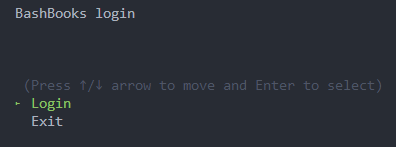
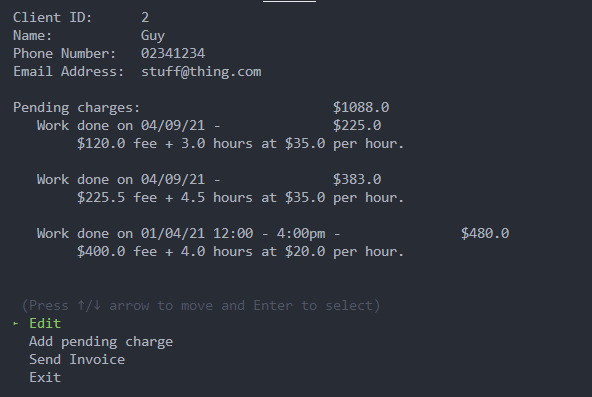
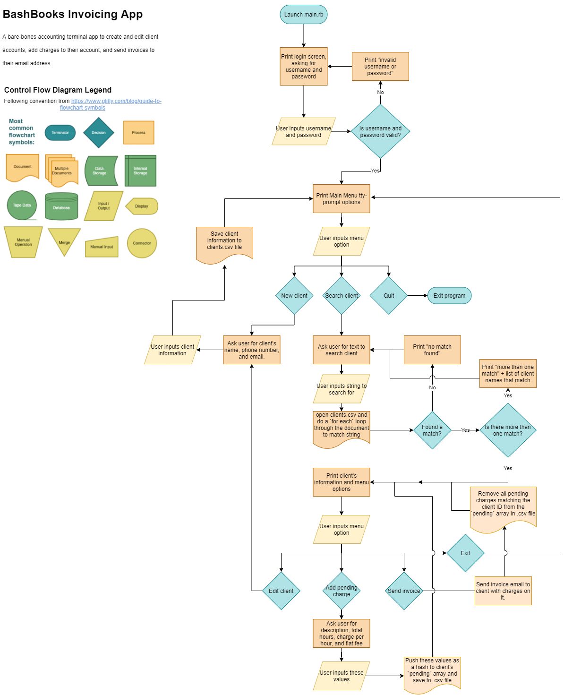
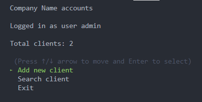
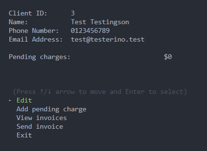
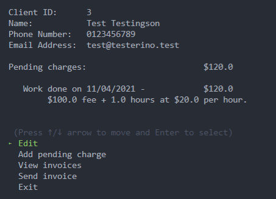
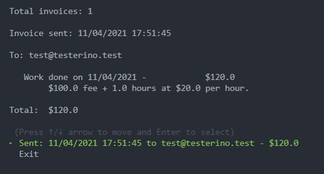

# Software development plan

> ## Design a Software Development Plan for a terminal application. The following requirements provide details of what needs to be included in this plan

---

> ## R5 Develop a statement of purpose and scope for your application. It must include:
> - describe at a high level what the application will do
> - identify the problem it will solve and explain why you are developing it
> - identify the target audience
> - explain how a member of the target audience will use it

## BashBooks

An invoice app for the terminal worker

BashBooks will provide an interface for a worker to create, read, update, and delete client entries. The user can search for a client by name, phone number, or email, and then can edit the client's details or add and remove pending charges to their account. The client list will be stored in a ~~.csv~~ JSON file containing key/value pairs for the client's information:

- A unique ID for each client
- First name
- Last name
- Contact phone number
- Primary Email address
- An array of invoice unique IDs that the client has been sent
- An array of pending charges: each pending charge will have a description, hours worked, charge per hour, and flat charges.

The user can then generate an invoice which will remove the pending charges and copy them into an invoice template, and then email to the client. Each invoice sent will be stored in a seperate ~~.csv~~ JSON file containing an invoice ID, client ID, date sent, due date, and array of pending charges.

Contractors and freelance developers need to charge for their work and keep a database of client contact information so they can contact their clients for marketing and to get paid. Traditionally this could be done in a messy pile of invoice word documents and excel spreadsheets but BashBooks aims to simplify this work all in one place, so the freelancer can focus their effort on more important work.

The target audience would be a freelance developer or contractor that charges by the hour. They can use BashBooks through the terminal by selecting the option to **search** for an invoice or client, or they can select the option to add a new client in the menu. They can **add** new clients by entering their details and then **add** pending charges to keep track of the work they've done for their client and then easily invoice for their work by selecting the **send invoice** option in the menu when they need to settle the account. The contractor can also export the ~~.csv~~ JSON file so they can open it another app if they need

> ## R6 Develop a list of features that will be  included in the application. It must include:
> - at least THREE features
> - describe each feature
> 
> Note: Ensure that your features above allow you to demonstrate your understanding of the following language elements and concepts:
> - use of variables and the concept of variable scope
> - loops and conditional control structures
> - error handling
> 
> Consult with your educator to check your features are sufficient

---

## BashBooks features:

## User logins with permissions
Upon launching the app, the user will be presented with a login prompt, and using a `while` loop my app will ask the user for a username and password until they provide a correct combination. The MVP will have an `admin` login and also a `guest` login that will have read-only permission. I will use error handling to make sure the input is alphanumeric.

## Adding clients to company file
When logged in for the first time, the user will be prompted for a company name, and there will be a conditional control structure `while` loop to present a menu to the user for them to **add** or **search** for a client. The user can **add** clients from the menu which will store a Client ID, Name, phone number, and email address, and store the client's information in a ~~.csv~~ JSON file on their computer.

## FullText Searching for clients in company file
Upon selecting the **search client**, it will use a `while` loop to `gets` ask the user for a text input, then it will use a `for each` loop to open the clients ~~.csv~~ JSON file and push the results that match the text input from the user into a `hash` variable, then print the hash to the screen and **select** that client. If there is more than one match, the terminal will print "More than one client matching [text input]" and will ask the user for a text input again. The user can type "exit" to go back to the main menu. I will use error-handling to make sure the text input is alphanumeric.

## Add charges to a client's account and send email invoices for them
When a search returns a single client result, they will be **selected**, and the menu will use a `tty-prompt` to ask the user if they want to **edit client**, **add pending charge**, **send invoice**, or **exit**. If the user selects **edit client** they will then be able to change the details for the stored client. **Add pending charge** will add a pending charge and the user can input the details for the charge. **Send invoice will copy the pending charges into an email to be sent to the customer's email, using the Net::SMTP Ruby class. Then it will remove all pending charges from the client's account.

> ## R7 Develop an outline of the user interaction and experience for the application.
> Your outline must include:
> - how the user will find out how to interact with / use each feature
> - how the user will interact with / use each feature
> - how errors will be handled by the application and displayed to the user

Upon opening the app, the user will see a prompt for a username and password and so they will know they need to type this in, for demonstration purposes the app will simply accept admin/admin and guest/guest for the write and read accounts respectively. This will use the `tty-prompt` method `mask` for the password to cover up the password in the terminal. There will be error handling in the login method to display an error if the username and password is wrong or if they have entered characters that aren't alphanumeric.

## Main Menu

The main menu will use a `tty-prompt` object `TTY::Prompt.new` with a `select` method to display a menu navigated with the arrow keys. The user will see three options **search client**, **add new client** and **quit**. The user will see the three options and can select one with the enter/return key. There will be error catching in case the `tty-prompt` gem returns an unexpected result.

## Search client

The search client menu will prompt the user to type in alphanumeric text to search for an existing client, and will return the result. There will be error handling in case the ~~.csv~~ JSON file is missing or corrupt, in which case it will create a new one. The error handling will also display an error message to the user if they type in any non-alphanumeric characters.

## Selected client

The selected client menu will display all the information on the client found with the search, and the user will then be prompted with `edit`, `add pending charge`, `send invoice`, `delete` or `exit`. The user can navigate this menu using the arrow keys and the enter/return key.

## Edit client

The user can then select the field to change and will then be prompted to change the field they select with the menu. There will be error checking to make sure the email format is valid, and that the phone number only contains numbers, otherwise there will be an error displayed "invalid email/phone number".

## Add pending charge

The user can type in a description, hours, charge per hour, and flat fees to add to the customer's account. There will be error checking to make sure the charges are numerical, otherwise there will be an error message displayed "Numbers only in the charge field".

## Send invoice

The user can select this option if there is one or more pending charges to clear all pending charges and send an invoice with them on it to the customer's email. The invoice ID, date and charges will be saved in an invoices~~.csv~~ JSON file.

## Add new client

The user will be asked for a Name, email and phone number to add a new customer's account, the program will then append this to the clients~.csv~ JSON file. Error handling will make sure the inputs for email and phone number are valid.

> ## R8	Develop a diagram which describes the control flow of your application. Your diagram must:
> - show the workflow/logic and/or integration of the features in your application for each feature.
> - utilise a recognised format or set of conventions for a control flow diagram, such as UML.

> ## R9	Develop an implementation plan which:
> - outlines how each feature will be implemented and a checklist of tasks for each feature
> - prioritise the implementation of different features, or checklist items within a feature
> - provide a deadline, duration or other time indicator for each feature or checklist/checklist-item
> Utilise a suitable project management platform to track this implementation plan
> Your checklists for each feature should have at least 5 items.

Link to my [trello](https://trello.com/b/4dqxtBYP/bashbooks-ruby-app)

> ## R10	Design help documentation which includes a set of instructions which accurately describe how to use and install the application.
> You must include:
> - steps to install the application
> - any dependencies required by the application to operate
> - any system/hardware requirements

## System/Hardware requirements:

- Requires Ruby version 2.7.x or later to be installed
- Requires bundler to be installed [https://bundler.io/](https://bundler.io/)
- at least 1 CPU and 1 RAM
- Tested working on Windows 10 with WSL Ubuntu 18.04
- Also working on Ubuntu 20.04
- Does not work on Mac for some reason

## Installation Instructions

1. **For invoice emailing to work** - Sign up for a Mailjet account and get an API key and API secret
2. Run `setup.sh` from the `src` folder
3. Input API values in the setup prompt, and your email address
4. Run main.rb

## How to use

1. Run `ruby main.rb` from the src folder (Use the flag "-d" or "--debug" for debug mode, use this for reporting bugs)
2. Login with the credentials admin/admin for the main read/write privileges, or use guest/guest for read-only privileges
3. Enter your company name
4. From the main menu, begin creating customer accounts by selecting "Add new client" using the arrow keys and Enter/return to select.

5. After adding a client, you can now search for that client by selecting Search client in the main menu

6. With that client selected, you can add a pending charge to their account by selecting "Add pending charge"

7. With a charge on the account, you can now send invoices to that customer using "Send invoice"

8. After the invoice is sent, you can always view the invoice that was sent by selecting "View invoices"

9. It's as simple as that! If you ever need to export your client list, it is all stored in the "clients.json" file in the src folder.